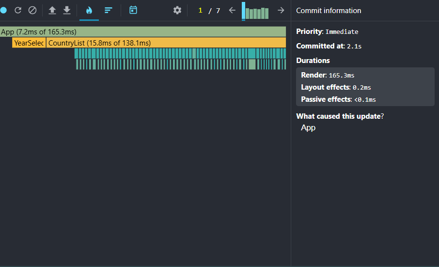
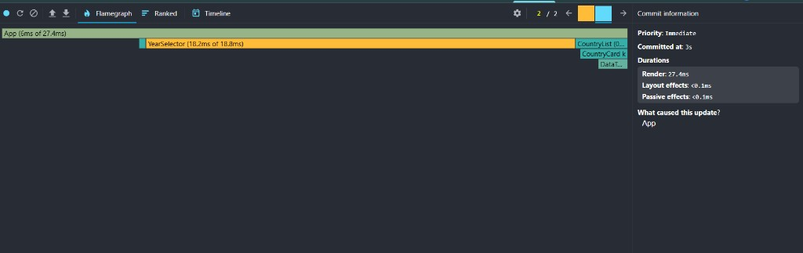
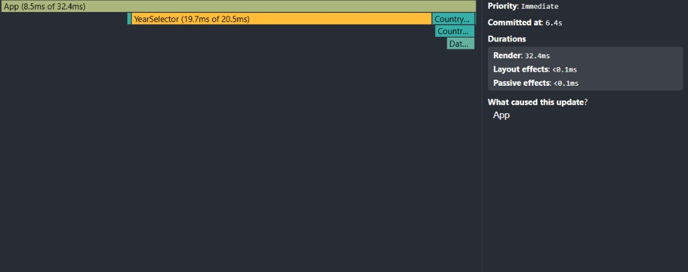
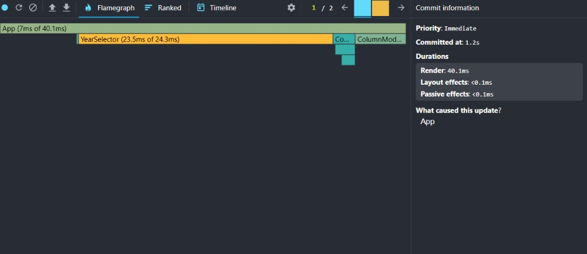
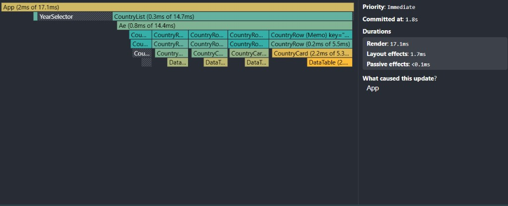
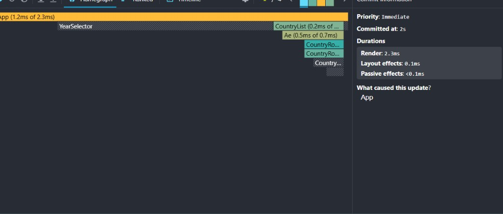
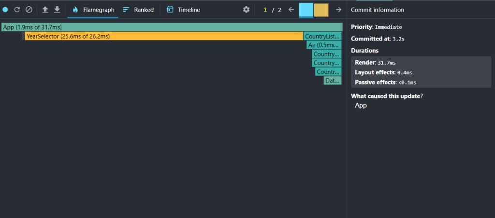
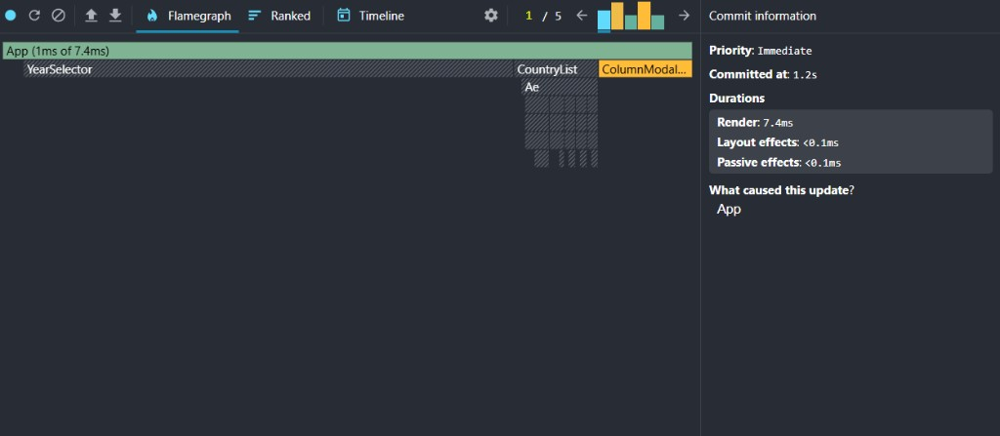

# Performance Report — CO₂ Emissions Data Explorer

## Test Environment

| Setting | Value |
|---------|-------|
| Branch | `performance` |
| Build mode | Development (`npm run dev`) |
| Browser | Chrome + React DevTools extension |
| React version | 19.2.0 |
| Dataset | 254 countries |

See [profiling-workflow-guide.md](./profiling-workflow-guide.md) for profiling steps.

---

## Phase 2: Optimizations Applied

| Technique | Where applied |
|-----------|---------------|
| `useMemo` | `app.tsx` (years, columns), `country-list.tsx` (filtered list), `country-card.tsx` (year data), `data-table.tsx` (record) |
| `useCallback` | `app.tsx` (all event handlers) |
| `React.memo` | `SearchBar`, `YearSelector`, `ColumnModal`, `CountryList`, `CountryCard`, `DataTable` |
| Stable keys | `country.id` in virtualized list, `column` in data table rows |
| Virtualization | `react-window` `List` in `CountryList` — only visible rows render |

---

## Phase 1: Baseline Profiling (Unoptimized)

### Summary

| Interaction | Commit Duration | Render Duration | Slowest Component |
|-------------|-----------------|-----------------|-------------------|
| Sorting countries | 165.3 ms | 165.3 ms | `CountryList` (138.1 ms) |
| Searching for a country | 27.4 ms | 27.4 ms | `YearSelector` (18.2 ms) |
| Selecting a different year | 32.4 ms | 32.4 ms | `YearSelector` (19.7 ms) |
| Toggling columns | 40.1 ms | 40.1 ms | `YearSelector` (23.5 ms) |

> Profiled in development mode before optimizations. Sorting re-rendered all 254 country cards.

---

### 1. Sorting Countries

| Metric | Value |
|--------|-------|
| Commit duration | 165.3 ms |
| Render duration | 165.3 ms |
| Slowest component | `CountryList` — 138.1 ms |



---

### 2. Searching for a Country

| Metric | Value |
|--------|-------|
| Commit duration | 27.4 ms |
| Render duration | 27.4 ms |
| Slowest component | `YearSelector` — 18.2 ms |



---

### 3. Selecting a Different Year

| Metric | Value |
|--------|-------|
| Commit duration | 32.4 ms |
| Render duration | 32.4 ms |
| Slowest component | `YearSelector` — 19.7 ms |



---

### 4. Toggling Columns

| Metric | Value |
|--------|-------|
| Commit duration | 40.1 ms |
| Render duration | 40.1 ms |
| Slowest component | `YearSelector` — 23.5 ms |



---

## Phase 3: Optimized Profiling (Comparison)

### Summary

| Interaction | Baseline | Optimized | Improvement |
|-------------|----------|-----------|-------------|
| Sorting countries | 165.3 ms | 17.1 ms | **89.7%** |
| Searching for a country | 27.4 ms | 2.3 ms | **91.6%** |
| Selecting a different year | 32.4 ms | 31.7 ms | **2.2%** |
| Toggling columns | 40.1 ms | 7.4 ms | **81.5%** |

```
Improvement (%) = ((baseline − optimized) / baseline) × 100
```

> After optimization, sort and search dropped below the 16 ms frame budget. Memoization (grey striped components in flame charts) prevents `YearSelector` and `CountryList` from re-rendering when their props are unchanged.

---

### 1. Sorting Countries

| Metric | Baseline | Optimized |
|--------|----------|-----------|
| Commit duration | 165.3 ms | 17.1 ms |
| Render duration | 165.3 ms | 17.1 ms |
| Slowest component | `CountryList` (138.1 ms) | `CountryCard` (~5.3 ms) |

**Improvement: 89.7%**

**Findings:**
- `useMemo` recalculates the sorted list without re-rendering unrelated components
- Virtualization renders only visible `CountryRow` items instead of all 254 cards
- `CountryRow (Memo)` label in flame chart confirms `React.memo` is working



---

### 2. Searching for a Country

| Metric | Baseline | Optimized |
|--------|----------|-----------|
| Commit duration | 27.4 ms | 2.3 ms |
| Render duration | 27.4 ms | 2.3 ms |
| Slowest component | `YearSelector` (18.2 ms) | `App` (1.2 ms) |

**Improvement: 91.6%**

**Findings:**
- `YearSelector` is greyed out (did not re-render) — `React.memo` + stable `useCallback` handlers
- Only `CountryList` and visible rows update on keystroke
- Largest relative improvement of all interactions



---

### 3. Selecting a Different Year

| Metric | Baseline | Optimized |
|--------|----------|-----------|
| Commit duration | 32.4 ms | 31.7 ms |
| Render duration | 32.4 ms | 31.7 ms |
| Slowest component | `YearSelector` (19.7 ms) | `YearSelector` (25.6 ms) |

**Improvement: 2.2%**

**Findings:**
- Smallest improvement — `YearSelector` must re-render when its `year` prop changes
- `YearSelector` still dominates because it renders hundreds of `<option>` elements
- Virtualization limits `CountryCard` updates to visible rows only (not all 254)



---

### 4. Toggling Columns

| Metric | Baseline | Optimized |
|--------|----------|-----------|
| Commit duration | 40.1 ms | 7.4 ms |
| Render duration | 40.1 ms | 7.4 ms |
| Slowest component | `YearSelector` (23.5 ms) | `ColumnModal` |

**Improvement: 81.5%**

**Findings:**
- `YearSelector` and `CountryList` are greyed out — they did not re-render
- Only `ColumnModal` and visible `DataTable` instances update
- `React.memo` on `CountryCard` / `DataTable` prevents off-screen cards from re-rendering



---

## Key Takeaways

1. **Sorting improved 89.7%** — virtualization + `useMemo` had the biggest impact on the worst baseline interaction
2. **Search improved 91.6%** — memoized siblings skip re-render on each keystroke
3. **Columns improved 81.5%** — only the modal and visible tables update
4. **Year change improved only 2.2%** — `YearSelector` with many options remains a bottleneck; further optimization could virtualize the year dropdown
5. **Grey striped components** in optimized flame charts confirm `React.memo` is preventing unnecessary re-renders
